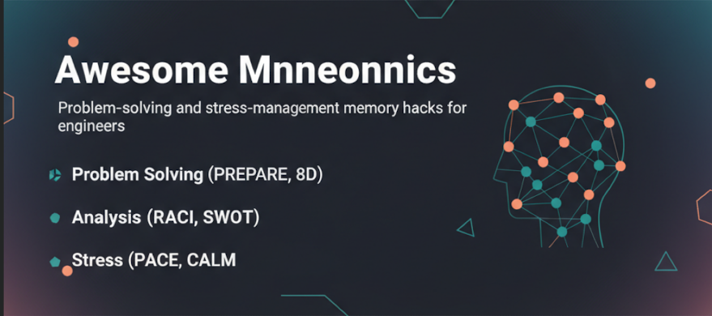

# Awesome Mnemonics [](https://awesome.re)

[](LICENSE)
[](http://makeapullrequest.com)
[](https://github.com/StewAlexander-com/Awesome-Mnemonics/graphs/commit-activity)
[](README.md#categorized-index)
[](SOURCES.md)



**A curated playbook of problem-solving and stress-management mnemonics.** Acronyms that compress workflows into actionable steps—for incidents, RCAs (root cause analysis), design decisions, and high-stress situations.

**Note:** This is a **field guide/playbook** with opinionated workflows (e.g., STOP → TRACE → DEBUG → 8D) rather than a traditional awesome list of external links. It focuses on battle-tested mnemonics with detailed guidance, real-world scenarios, and proven pipelines.

> [!WARNING]
> **Avoid Cognitive Overload**: Choose ONE framework matching your situation. Don't memorize all—reference as needed. Using multiple simultaneously reduces effectiveness.

**Quick links:** [📥 Downloads](releases/README.md) · [🎯 Scenarios](SCENARIOS.md) · [📚 Sources](SOURCES.md) · [🔧 CLI](#cli) · [📋 Table of Contents](#table-of-contents)

## 🚨 Quick Reference

| **Situation** | **Use This** | **Time** |
|---------------|--------------|----------|
| 🚨 Immediate crisis | [IDEA](#idea) → [STOP](#stop) | 2-5 min |
| 🔍 Root cause needed | [ICEBERG](#iceberg) + [5 Whys](#5-whys) | 30-60 min |
| 👥 Team conflict | [BREATHE](#breathe) → [PAUSE](#pause) → [WAIT](#wait) | 5-10 min |
| 📊 Strategic planning | [PREPARE](#prepare) + [SWOT](#swot) | 1-2 hours |
| 🏗️ System design | [SCALE](#scale-infrastructure-design) + [PESTEL](#pestel) | Planning |
| 🐛 Technical debugging | [TRACE](#trace-network-troubleshooting) → [DEBUG](#debug-code--system-analysis) | Variable |
| 😰 Stress overload | [PACE](#pace) → [ARIES](#aries) → [CALM](#calm) | 10-15 min |

**Crisis?** → [STOP → TRACE → DEBUG → 8D](#1-crisis-response-chain) | **Quick decision?** → [IDEA → DICE → FATE](#6-rapid-triage-chain)

## Table of Contents

- [Awesome Mnemonics ](#awesome-mnemonics-)
  - [🚨 Quick Reference](#-quick-reference)
  - [📑 Categorized Index](#-categorized-index)
    - [🔧 Ops](#-ops)
    - [🔍 RCA (Root Cause Analysis)](#-rca-root-cause-analysis)
    - [🏗️ Systems Design](#️-systems-design)
    - [👥 Human Factors](#-human-factors)
    - [🧘 Personal Life](#-personal-life)
  - [Who Uses This?](#who-uses-this)
  - [CLI](#cli)
  - [Quick Start (SRE / Infra)](#quick-start-sre--infra)
  - [🔄 Mnemonic Selection Flowchart](#-mnemonic-selection-flowchart)
  - [Table of Contents](#table-of-contents)
  - [🧩 Problem Solving Techniques](#-problem-solving-techniques)
    - [PREPARE](#prepare)
    - [PADDER](#padder)
    - [ICEBERG](#iceberg)
    - [IDEA](#idea)
    - [5 Whys](#5-whys)
    - [Ishikawa (Fishbone) Diagram](#ishikawa-fishbone-diagram)
    - [8D Approach](#8d-approach)
    - [A3 Problem Solving](#a3-problem-solving)
    - [5Ps](#5ps)
  - [📊 Problem Analysis](#-problem-analysis)
    - [RACI](#raci)
    - [PESTEL](#pestel)
    - [SWOT](#swot)
    - [SET (Systems Engineering Triangle)](#set-systems-engineering-triangle)
  - [⚠️ Problem Resolution Threats](#️-problem-resolution-threats)
    - [DICE](#dice)
    - [FATE](#fate)
    - [PEST](#pest)
  - [🗣️ Communication \& Conflict](#️-communication--conflict)
    - [BREATHE](#breathe)
    - [PAUSE](#pause)
    - [WAIT](#wait)
  - [🧘 Stress \& Resilience](#-stress--resilience)
    - [PACE](#pace)
    - [STOP](#stop)
    - [ARIES](#aries)
    - [CALM](#calm)
    - [SHINE](#shine)
  - [🔧 Infrastructure \& Systems Engineering](#-infrastructure--systems-engineering)
    - [TRACE (Network Troubleshooting)](#trace-network-troubleshooting)
    - [SCALE (Infrastructure Design)](#scale-infrastructure-design)
    - [DEBUG (Code \& System Analysis)](#debug-code--system-analysis)
  - [🔗 Proven Mnemonic Pipelines](#-proven-mnemonic-pipelines)
    - [**1. CRISIS RESPONSE CHAIN**](#1-crisis-response-chain)
    - [**2. CONFLICT RESOLUTION CHAIN**](#2-conflict-resolution-chain)
    - [**3. ROOT CAUSE INVESTIGATION CHAIN**](#3-root-cause-investigation-chain)
    - [**4. STRATEGIC DESIGN CHAIN**](#4-strategic-design-chain)
    - [**5. STRESS BURNOUT RECOVERY CHAIN**](#5-stress-burnout-recovery-chain)
    - [**6. RAPID TRIAGE CHAIN**](#6-rapid-triage-chain)
  - [📊 Pipeline Selection Matrix](#-pipeline-selection-matrix)
  - [💡 Pro Tips](#-pro-tips)
  - [🎯 Common Mistakes](#-common-mistakes)
  - [Selection Self-Check](#selection-self-check)
  - [Still Stuck?](#still-stuck)
  - [🤝 Contributing](#-contributing)
  - [📥 Release Versions](#-release-versions)
  - [Sources \& References](#sources--references)
    - [Problem-Solving Methodologies](#problem-solving-methodologies)
    - [Strategic \& Analysis Frameworks](#strategic--analysis-frameworks)
    - [Problem Resolution Threats \& Triage](#problem-resolution-threats--triage)
    - [Communication, Stress \& Resilience, Infrastructure](#communication-stress--resilience-infrastructure)

## Quick Reference

| Situation | Use These | Time |
|-----------|-----------|------|
| Crisis/Emergency | STOP, BREATHE | 2-5 min |
| Stress/Overwhelm | PACE, CALM, ARIES | 5-10 min |
| Argument/Conflict | BREATHE, PAUSE, WAIT | 3-7 min |
| Root Cause Analysis | 5 Whys, ICEBERG, 8D | 30min-4wks |
| Problem Solving | IDEA, PREPARE, PADDER | 15-60 min |
| Strategic Analysis | SWOT, PESTEL | 1-4 hrs |
| Team Coordination | RACI, 8D Approach | Ongoing |

---

## 📑 Categorized Index

*Browse by category; each entry links to full definition and when-to-use guidance.*

### 🔧 Ops
*Incidents, troubleshooting, ops decisions.*
[STOP](#stop) · [IDEA](#idea) · [TRACE](#trace-network-troubleshooting) · [DEBUG](#debug-code--system-analysis) · [DICE](#dice) · [FATE](#fate) · [PEST](#pest)

### 🔍 RCA (Root Cause Analysis)
*Deep investigation, recurring issues, prevention.*
[ICEBERG](#iceberg) · [5 Whys](#5-whys) · [Ishikawa](#ishikawa-fishbone-diagram) · [8D Approach](#8d-approach) · [A3 Problem Solving](#a3-problem-solving) · [PADDER](#padder) · [PREPARE](#prepare)

### 🏗️ Systems Design
*Architecture, planning, technical decisions.*
[SCALE](#scale-infrastructure-design) · [SWOT](#swot) · [PESTEL](#pestel) · [SET](#set-systems-engineering-triangle)

### 👥 Human Factors
*Team dynamics, conflict resolution, and collaboration*
[RACI](#raci) · [WAIT](#wait) · [BREATHE](#breathe) · [PAUSE](#pause)

### 🧘 Personal Life
*Stress, burnout, resilience.*
[PACE](#pace) · [ARIES](#aries) · [CALM](#calm) · [SHINE](#shine)

---

## Who Uses This?

*No entries yet — **be the first.*** One-line PR, e.g. `**[Acme](https://acme.com)** — SRE uses STOP→TRACE→DEBUG`. [How](CONTRIBUTING.md#who-uses-this).

---

## CLI

`mnemonic` — look up pipelines and search mnemonics by topic.

**Install:** `pip install git+https://github.com/StewAlexander-com/Awesome-Mnemonics.git`  
**Examples:** `mnemonic pipeline crisis` · `mnemonic search network` · `mnemonic search stress -o json`  
**Alias:** `alias incident='mnemonic pipeline crisis'` in `~/.zshrc`

---

## Quick Start (SRE / Infra)

1. **Runbook** — Copy [incident-response-runbook.md](templates/incident-response-runbook.md) (STOP→TRACE→DEBUG→8D) into Confluence, wiki, or runbook store.
2. **CLI** — `pip install git+https://github.com/StewAlexander-com/Awesome-Mnemonics.git` then `mnemonic pipeline crisis`
3. **Alias** — `alias incident='mnemonic pipeline crisis'` in `~/.zshrc`

---

## 🔄 Mnemonic Selection Flowchart

```
                    ┌─────────────┐
                    │  Problem?   │
                    └──────┬──────┘
                           │
              ┌────────────┼────────────┐
              │            │            │
         ┌────▼───┐   ┌────▼───┐   ┌────▼────┐
         │ Quick? │   │Complex?│   │ Stress? │
         └────┬───┘   └────┬───┘   └────┬────┘
              │            │            │
         ┌────▼────┐  ┌────▼─────┐  ┌───▼────┐
         │  IDEA   │  │PREPARE/  │  │ STOP → │
         │    +    │  │ICEBERG+  │  │ PACE   │
         │  STOP   │  │ 5 Whys   │  └────────┘
         └─────────┘  └──────────┘
```

**Summary:** Quick? → IDEA+STOP · Complex? → PREPARE/ICEBERG+5 Whys · Stress? → STOP→PACE

---

## 🧩 Problem Solving Techniques

*Full definitions for each mnemonic; [Categorized Index](#categorized-index) above to browse by use case.*

### PREPARE  

**Use when:** Strategic planning, multi-stakeholder; needs structure | **Time:** 1–2 hr | **Complexity:** ★★☆

```
P - **Prioritize** the problem  
R - **Research** & brainstorm solutions  
E - **Evaluate** available options  
P - **Plan** steps to resolve issue  
A - **Act** on the plan  
R - **Reflect** on results  
E - **Evaluate** and revise plan as necessary  
```

**💡 When to use:** Strategic planning (1–2 hr); medium complexity, multi-stakeholder; needs structure. *Not for outages—use [STOP](#stop)→[TRACE](#trace-network-troubleshooting)→[DEBUG](#debug-code--system-analysis) first; PREPARE in post-mortem.*

**⚠️ Pitfalls:** Analysis paralysis — if past 30 min on Research, switch to [IDEA](#idea). Skipping Reflect/Evaluate → recurring issues.

**🔗 Combines well with:** [RACI](#raci), [SWOT](#swot), [ICEBERG](#iceberg)

**📋 Example:** *Infra migration: PREPARE for structure, RACI for roles, SWOT for cloud provider choice.*
### PADDER

```
P - **Pinpoint** problem  
A - **Analyze** data and look for patterns  
D - **Develop** solution & consider other ways to solve the issue—try to have more than one option
D - **Design** action plan  
E - **Execute** action plan & Monitor Results  
R - **Reevaluate** and refine plan as needed  
```

**When to use:** Data-driven; pattern identification. Pairs with [8D](#8d-approach) D3 (Interim Containment) for quick fixes. **Time:** 15–60 min. **Complexity:** ★★☆.

**🔗 Combines well with:** [IDEA](#idea) (simpler), [8D](#8d-approach) (formal), [A3](#a3-problem-solving) (one-page PADDER for sharing)

**📋 Real-world example:** *Recurring server crashes - Pinpoint timing, Analyze logs for patterns, Develop interim solutions (restart service) + permanent fix (increase memory), Monitor effectiveness*
### ICEBERG

**Use when:** Complex, deep analysis; surface symptoms hide root causes | **Time:** 30–60 min | **Complexity:** ★★★

```
I - **Identify** issue(s)  
C - **Collect** data and analyze situation  
E - **Examine** possible (root) causes  
B - **Brainstorm** solutions  
E - **Execute** solution(s)  
R - **Review**, evaluate, and adjust solutions  
G - **Gather** feedback  
```

**💡 When to use:** Complex, deep analysis (30–60 min); surface symptoms hide root causes; escalate from [IDEA](#idea) when complexity grows.

**⚠️ Pitfalls:** Too deep on simple (e.g. 5‑min password reset): start with IDEA, escalate if needed. Skipping G (feedback): prevents recurrence; complete the cycle.

**🔗 Combines well with:** [5 Whys](#5-whys), [Ishikawa](#ishikawa-fishbone-diagram) (fishbone for Examine), [8D](#8d-approach), [IDEA](#idea) (escalate if needed)

**📋 Real-world example:** *Network performance degradation - Identify slowness, Collect metrics (latency, packet loss), Examine causes (routing changes, bandwidth saturation), Brainstorm solutions, Execute, Review with team, Gather feedback from users*
### IDEA

```
I - **Identify** problem  
D - **Develop** Solution  
E - **Execute** Solution
A - **Assess** Solution  
```

**When to use:** Quick, simple; crisis—use [STOP](#stop) first if stressed. **Time:** 2–5 min. **Complexity:** ★☆☆.

**⚠️ Pitfalls:** Escalation: if past 10 min or multiple blockers → [ICEBERG](#iceberg) or [PREPARE](#prepare). Skipping A: validate; prevents recurrence.

**🔗 Combines well with:** [STOP](#stop) (crisis), [PREPARE](#prepare)/[ICEBERG](#iceberg) (escalate)

**📋 Real-world example:** *User can't access VPN - Identify (connection error), Develop (reset credentials), Execute (send new password), Assess (confirm access restored)*
### 5 Whys

* Keep asking why until root causes are identified

**When to use:** Root cause analysis; [8D](#8d-approach) D4; combine with [ICEBERG](#iceberg) for deep dives. **Time:** variable. **Complexity:** ★★☆.

**⚠️ Pitfalls:** Don’t stop at symptoms (e.g. "DB slow")—drill to process/systemic failure. Multiple root causes: use 5 Whys per branch.

**🔗 Combines well with:** [ICEBERG](#iceberg), [Ishikawa](#ishikawa-fishbone-diagram) (branches, then "why" on each), [8D](#8d-approach)

**📋 Real-world example:** *Deployment failures - Why? Pipeline failed. Why? Tests timed out. Why? Database slow. Why? Index missing. Why? Schema change didn't include migration. Root cause: Missing migration validation step*

### Ishikawa (Fishbone) Diagram

*Cause–effect; map multiple causes to one problem. Pairs with 5 Whys.*

```
1. State the problem (head of the fish)
2. Choose categories (e.g. 6 M's: Machine, Method, Material, Manpower, Measurement, Milieu/Environment)
3. Brainstorm causes in each category (bones)
4. Drill into "why" for significant causes (use 5 Whys on branches)
5. Identify root causes to address
```

**When to use:** Multiple causes (5 Whys may miss branches); [8D](#8d-approach) D4 or [ICEBERG](#iceberg) Examine; brainstorm across people, process, tech, environment. **Time:** 30–60 min. **Complexity:** ★★☆.

**⚠️ Pitfalls:** Too many bones: limit branches, focus on likely. Skipping drill-down: use [5 Whys](#5-whys) on likely bones.

**🔗 Combines well with:** [5 Whys](#5-whys), [8D](#8d-approach) D4, [ICEBERG](#iceberg), [A3](#a3-problem-solving) (fishbone on A3)

**📋 Real-world example:** *Uptime drop - Problem (head): "Services unreachable." Bones: Method (recent deploy), Machine (high CPU), Manpower (config change). Drill with 5 Whys on "recent deploy" → missing health-check in pipeline. Root cause: CI didn't run post-deploy checks.*

### 8D Approach

*Industry standard in automotive/manufacturing, adapted for IT incident management*

```
D1 - **Form** a team  
D2 - **Describe** the problem  
D3 - **Interim** Containment Action (the "band-aid")  
D4 - **Root** Cause Analysis & Escape Point(s)  
D5 - **Permanent** Corrective Actions  
D6 - **Implement** & Validate Corrective Actions  
D7 - **Prevent** reoccurrence(s)  
D8 - **Congratulate** your team and close the loop (closure & celebration)
```

**When to use:** Critical incidents, formal resolution; documentation and prevention; team coordination (D1: [RACI](#raci)). **Time:** 30 min–4 wks. **Complexity:** ★★★.

**⚠️ Pitfalls:** Stopping at D3: reach D7 or it recurs. Solo 8D: use D1 (Form a team) and [RACI](#raci). Bureaucracy: use [IDEA](#idea) or [PREPARE](#prepare) for non-critical.

**🔗 Combines well with:** [PADDER](#padder) (D3), [5 Whys](#5-whys)+[Ishikawa](#ishikawa-fishbone-diagram)+[ICEBERG](#iceberg) (D4), [A3](#a3-problem-solving) (one-page 8D), [RACI](#raci) (D1)

**📋 Real-world example:** *Data breach incident - Form security response team ([RACI](#raci) roles), Describe scope, Contain (disable compromised accounts), Analyze root cause ([5 Whys](#5-whys): phishing → no MFA → insufficient training), Implement MFA, Validate with penetration test, Prevent (mandatory security awareness), Celebrate team response*

### A3 Problem Solving

*Toyota's single-page (A3 size) structured problem-solving. Plan–Do–Check–Act on one sheet for clarity and alignment.*

```
1. Background & problem statement
2. Current state / gap
3. Goal / target state
4. Root cause analysis (use 5 Whys or Ishikawa)
5. Countermeasures
6. Implementation plan & follow-up (Check)
```

**When to use:** Share problem and plan on one page; lighter than [8D](#8d-approach); recurring/medium severity; socialize [ICEBERG](#iceberg) or [PADDER](#padder) output. **Time:** 1–2 hr. **Complexity:** ★★☆.

**⚠️ Pitfalls:** Cramming: if it doesn’t fit, split or use 8D. Root cause box: use [5 Whys](#5-whys) or [Ishikawa](#ishikawa-fishbone-diagram), not symptoms.

**🔗 Combines well with:** [5 Whys](#5-whys), [Ishikawa](#ishikawa-fishbone-diagram) (root cause box), [8D](#8d-approach) (A3 summarizes), [ICEBERG](#iceberg), [PADDER](#padder)

**📋 Real-world example:** *Sprint overruns - A3: Background (delivery slipping), Current state (scope creep, no Definition of Done), Goal (predictable sprints), Root cause (5 Whys → no intake prioritization), Countermeasures (backlog refinement + DoD), Plan (next 2 sprints). Share with product and eng leadership on one page.*

### 5Ps
*Poor planning produces pitiful products.* — Use as a reminder during planning; don’t skip [PREPARE](#prepare).

## 📊 Problem Analysis

*Frameworks for scope and impact.*

### RACI

*Roles and responsibilities in problem-solving.*

```
R - **Responsible** (does the work)
A - **Accountable** (final approval)
C - **Consulted** (provides input)
I - **Informed** (kept updated)
```

**When to use:** Role confusion; [8D](#8d-approach) D1 (Form a team); end of WAIT→BREATHE→PAUSE for conflict. **Time:** ongoing. **Complexity:** ★☆☆.

**⚠️ Pitfalls:** One "A" per task. Too many "C" slows decisions—only critical input.

**📋 Example:** *Infra upgrade: R=DevOps, A=Infra Manager, C=Security, I=All devs.*
### PESTEL

*External factors that impact a problem or decision.*

```
P - **Political**
E - **Economic**
S - **Sociocultural**
T - **Technological**
E - **Environmental**
L - **Legal**
```

**When to use:** Strategic planning, external factors; [SCALE](#scale-infrastructure-design) validation; architecture, compliance. **Time:** 1–4 hrs. **Complexity:** ★★☆.

**📋 Real-world example:** *Cloud migration planning - Political (vendor lock-in concerns), Economic (cost optimization), Technological (API compatibility), Legal (data sovereignty requirements)*

### SWOT

*Internal and external factors for a problem or decision.*

```
S - **Strengths**
W - **Weaknesses**
O - **Opportunities**
T - **Threats**
```

**When to use:** [PREPARE](#prepare)'s "Evaluate options" step; [SCALE](#scale-infrastructure-design) design validation; strategic decision making. **Time:** 1–4 hrs. **Complexity:** ★★☆.

**📋 Real-world example:** *Choosing deployment strategy - Strengths: automated rollback, Weaknesses: longer deployment time, Opportunities: canary testing, Threats: increased complexity*
### SET (Systems Engineering Triangle)
*Good, Fast, Cheap: pick 2; the third suffers.* (Fast+Cheap≠Good, Fast+Good≠Cheap, Good+Cheap≠Fast.)

**When to use:** Set expectations; end of SCALE→SWOT→PESTEL; architecture trade-offs. **Time:** quick. **Complexity:** ★☆☆.

**📋 Real-world example:** *Urgent security patch — Good+Fast ⇒ not cheap (overtime). Set expectations with leadership.*

*[SEBoK](https://www.sebokwiki.org/wiki/Guide_to_the_Systems_Engineering_Body_of_Knowledge_(SEBoK))*

## ⚠️ Problem Resolution Threats

*Blockers before they derail.*

### DICE

```
D - **Delay**
I - **Incompetence**
C - **Conflict**
E - **External** factors
```

**When to use:** [IDEA](#idea)→[DICE](#dice)→[FATE](#fate) triage; blockers before execution; risk in [PREPARE](#prepare) phase. **Time:** 10–30 min. **Complexity:** ★☆☆.

### FATE

```
F - **Funding**
A - **Allocation** of resources 
T - **Time**
E - **Expertise**
```

**When to use:** Resource validation in triage; feasibility; after [DICE](#dice) to validate resources. **Time:** 10–30 min. **Complexity:** ★☆☆.

### PEST

```
P - **Political**
E - **Economic**
S - **Social**
T - **Technological**
```

**When to use:** External threats to solutions; how to combat/remove. **Time:** 15–30 min. **Complexity:** ★☆☆.

## 🗣️ Communication & Conflict

*Calm, productive in difficult conversations.*

### BREATHE

```
B - **Breathe** deeply and slowly   
R - **Remain** rational and listen  
E - **Empathize** with the other person's problem
A - **Ask** questions to understand  
T - **Take** a break if needed  
H - **Hold** back from reacting  
E - **Express** yourself calmly  
```

**When to use:** First when tensions rise (breathing regulates); WAIT→BREATHE→PAUSE→[RACI](#raci); if break needed → PAUSE. **Time:** 3–7 min. **Complexity:** ★☆☆.

**⚠️ Pitfalls:** Fake: breathing must be intentional and deep. Weaponizing: don’t use dismissively; damages trust.

**🔗 Combines well with:** [WAIT](#wait), [PAUSE](#pause), [STOP](#stop)

**📋 Real-world example:** *Stakeholder disagrees with technical approach in meeting - Breathe deeply (regulate emotions), Remain rational, Empathize with their concerns, Ask clarifying questions, Take 5-minute break if tension escalates, Hold back defensive reactions, Express technical rationale calmly*
### PAUSE

```
P - **Put** things in perspective   
A - **Acknowledge** your feelings and theirs
U - **Understand** that you don't have to act/react right away  
S - **Step** Away from the situation  
E - **Evaluate** options and plan before acting   
```

**When to use:** When BREATHE isn't enough—need physical separation; "Step Away" connects to WAIT; combine with STOP for immediate stress de-escalation. **Time:** 5–20 min. **Complexity:** ★☆☆.

**🔗 Combines well with:** [BREATHE](#breathe) (first step), [WAIT](#wait) (listen before speaking), [STOP](#stop) (stress response)

**📋 Real-world example:** *Heated debate about architecture decision - Put in perspective (not life-or-death), Acknowledge both viewpoints have merit, Don't decide now, Step away for lunch break, Evaluate pros/cons offline, Return with structured comparison*

### WAIT
*"Why am I troubled / talking?"* — Choose the right response; often listening is better.

**When to use:** Before speaking; first in WAIT→BREATHE→PAUSE→RACI. Use BREATHE to regulate, then WAIT to choose. **Time:** instant. **Complexity:** ★☆☆.

**⚠️ Pitfalls:** Not "don’t respond"—choose effectively. Don’t use WAIT to avoid necessary communication or to dodge escalation.

**🔗 Combines well with:** [BREATHE](#breathe), [PAUSE](#pause)

**📋 Example:** *Accusatory email: Ask "Why troubled?" (ego?) and "Why talking?" (defend or resolve?). BREATHE+PAUSE; respond later with facts.* 

## 🧘 Stress & Resilience

*Calm and connected under pressure.*

### PACE

```
P - **Physical** activity
A - **Avoiding** unhealthy behaviors
C - **Coping** skills
E - **Emotional** awareness
```

**When to use:** First in PACE→ARIES→CALM→SHINE; immediate stress. **Time:** 5–10 min. **Complexity:** ★☆☆.

### STOP

```
S - **Step** back
T - **Take** a deep breath
O - **Observe** what is happening
P - **Pull** back and put things in perspective
```

**When to use:** First response to ANY crisis—immediate stress management; start of STOP→[TRACE](#trace-network-troubleshooting)→[DEBUG](#debug-code--system-analysis)→[8D](#8d-approach) crisis chain; use with IDEA for quick problem resolution. **Time:** 2–5 min. **Complexity:** ★☆☆.

**⚠️ Common pitfalls:**
- **Going through motions** - Rushing through STOP without actually calming. The "Take a deep breath" must be intentional - pause for 3-5 seconds.
- **Stopping at STOP** - Using STOP but not proceeding to next step (TRACE/IDEA). STOP is the foundation, not the solution.

**🔗 Combines well with:** [BREATHE](#breathe) + [PAUSE](#pause) (breathing techniques), [IDEA](#idea) (quick problem solving)

**📋 Real-world example:** *Production alert at 2 AM - Step back (don't panic), Take deep breath (reduce adrenaline), Observe (read alert details), Pull back perspective (assess severity before waking team), Then proceed to TRACE for diagnostics*

### ARIES

```
A - **Avoid** unnecessary stress
R - **Relax** and take breaks
I - **Incorporate** physical activity into your routine
E - **Eat** a healthy diet
S - **Sleep** well
```

**When to use:** Lifestyle in PACE→ARIES→CALM; long-term stress recovery. **Time:** 2–4 weeks. **Complexity:** ★★☆.

### CALM

```
C - **Confidence:** Believe in your abilities and strengths
A - **Awareness:** Stay conscious of your thoughts and feelings
L - **Logic:** Use rational thinking to overcome doubts
M - **Mindfulness:** Practice being present and focused
```

**When to use:** Builds long-term resilience and confidence; use after PACE or ARIES for comprehensive stress management; confidence connects to SHINE. **Time:** 5–10 min (ongoing). **Complexity:** ★☆☆.

**🔗 Combines well with:** [SHINE](#shine), [PACE](#pace), [ARIES](#aries)

### SHINE

```
S - **Stay** present, in the moment  
H - **Have** a healthy positive perspective  
I - **Identify** and do positive activities   
N - **Nourish** positive relationships  
E - **Express** yourself  
```

**When to use:** End of PACE→ARIES→CALM→SHINE; ongoing positivity; links to [CALM](#calm). **Time:** ongoing. **Complexity:** ★☆☆.

## 🔧 Infrastructure & Systems Engineering

*Infra and DevOps.*

### TRACE (Network Troubleshooting)

```
T - **Test** connectivity (ping, traceroute)
R - **Review** logs and metrics
A - **Analyze** packet captures
C - **Check** configurations
E - **Escalate** with documented evidence
```

**When to use:** With [PREPARE](#prepare) and [8D](#8d-approach); T for quick, A for deep; document for 8D D2. **Time:** variable. **Complexity:** ★★☆.

**🔗 Combines well with:** [PREPARE](#prepare), [8D](#8d-approach)

### SCALE (Infrastructure Design)

```
S - **Security** by design
C - **Capacity** planning
A - **Automation-first**
L - **Load** balancing
E - **Error** handling/resilience
```

**When to use:** [SWOT](#swot) for design validation; [PESTEL](#pestel) for external factors; [SET](#set-systems-engineering-triangle) for trade-offs per component. **Time:** 1–4 hrs. **Complexity:** ★★☆.

**🔗 Combines well with:** [SWOT](#swot), [PESTEL](#pestel), [SET](#set-systems-engineering-triangle)

### DEBUG (Code & System Analysis)

```
D - **Define** the problem (what changed?)
E - **Examine** error messages/logs
B - **Break** down into components
U - **Understand** data flow
G - **Generate** hypothesis and test
```

**When to use:** [5 Whys](#5-whys) + [ICEBERG](#iceberg); start with D (often misstated); with [TRACE](#trace-network-troubleshooting) for network/system. **Time:** variable. **Complexity:** ★★☆.

**🔗 Combines well with:** [5 Whys](#5-whys), [ICEBERG](#iceberg), [TRACE](#trace-network-troubleshooting)

## 🔗 Proven Mnemonic Pipelines

*Ordered chains of mnemonics for end-to-end workflows (e.g. crisis, conflict, root cause).*

### **1. CRISIS RESPONSE CHAIN**
**STOP → TRACE → DEBUG → 8D**

**When:** Production outages, system failures, critical incidents · **Time:** 1–4 hr

**Flow:** [STOP](#stop) → [TRACE](#trace-network-troubleshooting) → [DEBUG](#debug-code--system-analysis) → [8D](#8d-approach)

**Why:** STOP stabilizes; TRACE gathers evidence; DEBUG structures analysis; 8D prevents recurrence.

### **2. CONFLICT RESOLUTION CHAIN**
**WAIT → BREATHE → PAUSE → RACI**

**When:** Team disagreements, tense meetings, stakeholder conflicts · **Time:** 5–20 min

**Flow:** [WAIT](#wait) → [BREATHE](#breathe) → [PAUSE](#pause) → [RACI](#raci)

**Why:** WAIT prevents escalation; BREATHE regulates; PAUSE creates space; RACI clarifies roles (often the root cause).

### **3. ROOT CAUSE INVESTIGATION CHAIN**
**ICEBERG → 5 Whys → PADDER → RACI**

**When:** Recurring issues, complex systems, post-incident · **Time:** 1–2 hr

**Flow:** [ICEBERG](#iceberg) → [5 Whys](#5-whys) → [PADDER](#padder) → [RACI](#raci)

**Why:** ICEBERG structures; 5 Whys drill to root cause; PADDER plans; RACI ensures accountability.

### **4. STRATEGIC DESIGN CHAIN**
**SCALE → SWOT → PESTEL → SET**

**When:** Infrastructure planning, architecture reviews, capacity · **Time:** 2–4 hr

**Flow:** [SCALE](#scale-infrastructure-design) → [SWOT](#swot) → [PESTEL](#pestel) → [SET](#set-systems-engineering-triangle)

**Why:** SCALE sets requirements; SWOT evaluates; PESTEL finds external risks; SET manages expectations.

### **5. STRESS BURNOUT RECOVERY CHAIN**
**PACE → ARIES → CALM → SHINE**

**When:** Long-term stress, approaching burnout, lifestyle reset · **Time:** 2–4 weeks (habit formation)

**Flow:** [PACE](#pace) → [ARIES](#aries) → [CALM](#calm) → [SHINE](#shine)

**Why:** PACE (immediate); ARIES (lifestyle); CALM (resilience); SHINE (sustainable).

### **6. RAPID TRIAGE CHAIN**
**IDEA → DICE → FATE**

**When:** Quick wins, time-critical decisions, feasibility check · **Time:** 10–30 min

**Flow:** [IDEA](#idea) → [DICE](#dice) → [FATE](#fate)

**Why:** IDEA (fast frame); DICE (blockers); FATE (resources).

## 📊 Pipeline Selection Matrix

| **Your Situation** | **Pipeline** | **Key Benefit** |
|-------------------|-------------|-----------------|
| 🚨 System down NOW | [STOP](#stop) → [TRACE](#trace-network-troubleshooting) → [DEBUG](#debug-code--system-analysis) → [8D](#8d-approach) | Systematic crisis response |
| 😤 Team conflict escalating | [WAIT](#wait) → [BREATHE](#breathe) → [PAUSE](#pause) → [RACI](#raci) | De-escalation + role clarity |
| 🔁 Same issue keeps happening | [ICEBERG](#iceberg) → [5 Whys](#5-whys) → [PADDER](#padder) → [RACI](#raci) | Deep root cause + prevention |
| 🏗️ Designing new infrastructure | [SCALE](#scale-infrastructure-design) → [SWOT](#swot) → [PESTEL](#pestel) → [SET](#set-systems-engineering-triangle) | Complete planning framework |
| 😰 Feeling burned out | [PACE](#pace) → [ARIES](#aries) → [CALM](#calm) → [SHINE](#shine) | Comprehensive stress recovery |
| ⚡ Need quick decision | [IDEA](#idea) → [DICE](#dice) → [FATE](#fate) | Fast feasibility assessment |

---

## 💡 Pro Tips

1. **Don’t skip steps** — Each mnemonic builds on the previous.
2. **Document at each stage** — STOP→TRACE→DEBUG; each step feeds the next.
3. **Branch when needed** — If [IDEA](#idea) reveals complexity, switch to [ICEBERG](#iceberg) → [5 Whys](#5-whys).
4. **Start with [STOP](#stop)** when emotionally activated.
5. **Teach your team** — Shared vocabulary speeds collaboration.

---

## 🎯 Common Mistakes

| Mistake | Problem | Fix | Example |
|---------|---------|-----|---------|
| **Jumping to solutions** | Skip [STOP](#stop)/[WAIT](#wait) when stressed → bad decisions | [STOP](#stop) first in crises; [WAIT](#wait) before reacting | 2 AM alert: SSH without STOP → wrong reboot. STOP (30 s) → assess → [TRACE](#trace-network-troubleshooting). |
| **Wrong pipeline** | [IDEA](#idea) won’t fix systemic issues | [ICEBERG](#iceberg) → [5 Whys](#5-whys) for recurring | Weekly DB timeouts: IDEA (restart) → returns. ICEBERG+5 Whys → missing pool config → permanent fix. |
| **Incomplete execution** | [8D](#8d-approach) stopped at D3 (band-aid) | Always reach D7 (Prevent Reoccurrence) | — |
| **Solo hero** | No [RACI](#raci) → no accountability if you’re out | [RACI](#raci) in 8D D1 (Form a team) | — |
| **Analysis paralysis** | PREPARE→ICEBERG→5 Whys→8D for simple issues | Start with [IDEA](#idea); escalate if complexity emerges | — |

- Don't use SWOT for root cause (use 5 Whys/ICEBERG instead)
- Don't start 8D solo (requires team)
- Don't apply multiple frameworks (pick ONE)

---

## Selection Self-Check

- [ ] Framework matches my situation type?
- [ ] I have required time/resources?
- [ ] Using ONE framework only?
- [ ] Can explain each step?

---

## Still Stuck?

1. **Simplify:** One-sentence problem description
2. **Return** to Quick Reference table
3. **Start** with IDEA (simplest framework)
4. **Seek** domain-specific expertise if needed

---

**[↑ Quick Reference](#quick-reference--on-call-guide) · [↑ Top](#awesome-mnemonics)**

## 🤝 Contributing

**This is a curated playbook, not a link collection.** We focus on battle-tested mnemonics with complete definitions, not external resources.

**Submission criteria:**
- ✅ **Battle-tested** — Used in production, real incidents, or engineering decisions
- ✅ **Provable/actionable** — Not just motivational, must have concrete steps
- ✅ **Cross-references** — Should link to related mnemonics where applicable
- ✅ **Real-world context** — Include actual usage examples
- ✅ **Memorable** — The acronym/pattern should be easy to recall under pressure

See [CONTRIBUTING.md](CONTRIBUTING.md) for full guidelines and submission template.

**Suggested GitHub topics for discoverability:** `8d-methodology`, `swot-analysis`, `pestel`, `systems-engineering`, `incident-response`, `root-cause-analysis`, `problem-solving`, `mnemonics`, `sre`, `devops`, `stress-management`, `framework`

---

## 📥 Release Versions

**v2.8** (2026-01-26) — Streamlined README: reduced content before TOC from ~160 to 31 lines, condensed Categorized Index, moved detailed sections after TOC for better navigation. [CHANGELOG](CHANGELOG.md)

**ZIP (all formats):** [Complete](https://github.com/StewAlexander-com/Awesome-Mnemonics/raw/main/releases/Awesome-Mnemonics-v2.8-Complete-Guide.zip) · [Quick Reference](https://github.com/StewAlexander-com/Awesome-Mnemonics/raw/main/releases/Awesome-Mnemonics-v2.8-Quick-Reference.zip)

**By format:** Complete — [PDF](https://github.com/StewAlexander-com/Awesome-Mnemonics/raw/main/releases/Awesome-Mnemonics-Complete-Guide.pdf) [DOCX](https://github.com/StewAlexander-com/Awesome-Mnemonics/raw/main/releases/Awesome-Mnemonics-Complete-Guide.docx) [RTF](https://github.com/StewAlexander-com/Awesome-Mnemonics/raw/main/releases/Awesome-Mnemonics-Complete-Guide.rtf) [MD](https://github.com/StewAlexander-com/Awesome-Mnemonics/raw/main/releases/Awesome-Mnemonics-Complete-Guide.md) · Quick — [PDF](https://github.com/StewAlexander-com/Awesome-Mnemonics/raw/main/releases/Awesome-Mnemonics-Quick-Reference.pdf) [DOCX](https://github.com/StewAlexander-com/Awesome-Mnemonics/raw/main/releases/Awesome-Mnemonics-Quick-Reference.docx) [RTF](https://github.com/StewAlexander-com/Awesome-Mnemonics/raw/main/releases/Awesome-Mnemonics-Quick-Reference.rtf) [MD](https://github.com/StewAlexander-com/Awesome-Mnemonics/raw/main/releases/Awesome-Mnemonics-Quick-Reference.md). *[releases/README](releases/README.md) for details.*

---

## Sources & References

**📚 For detailed citations, confidence ratings, and academic references, see [SOURCES.md](SOURCES.md).**

**🎯 For real-world scenarios showing how frameworks chain together, see [SCENARIOS.md](SCENARIOS.md).**

### Problem-Solving Methodologies
- **8D (Eight Disciplines)** ✓ — Ford Motor Company (1987). *Team Oriented Problem Solving Manual*. Evolved from TQM; in wide use in automotive and aerospace. [Wikipedia](https://en.wikipedia.org/wiki/Eight_disciplines_problem_solving)
- **5 Whys** ⚠ — Toyota Production System root cause technique; widely adapted across industries.
- **Ishikawa (Fishbone) Diagram** ✓ — Ishikawa, K. (1960s). University of Tokyo. Cause–effect diagram; central to Japanese quality control and Toyota. [Wikipedia](https://en.wikipedia.org/wiki/Ishikawa_diagram)
- **A3 Problem Solving** ✓ — Toyota Production System. Single A3-page structured problem-solving (plan–do–check–act); one-page report for alignment. [Wikipedia](https://en.wikipedia.org/wiki/A3_problem_solving)
- **PADDER, ICEBERG, IDEA, PREPARE** ℹ — Curated/educational problem-solving mnemonics for this collection.

### Strategic & Analysis Frameworks
- **PESTEL** ✓ — Aguilar, F. (1967). *Scanning the Business Environment*. Harvard; later extended to PESTLE/PESTEL (Legal, Environmental). [Background](https://www.linkedin.com/pulse/background-development-pestel-analysis-biplab-paul-8hj0c)
- **PEST** ℹ — Four-factor variant (Political, Economic, Social, Technological); conceptually from the PESTEL lineage.
- **SWOT** ✓ — Humphrey, A. (1960s–70s). Stanford Research Institute (SRI International); developed with Fortune 500 planning research. [e.g. Ninety](https://www.ninety.io/hubfs/Founders%20Framework%20-%20The%20SWOT%20Analysis%20and%20Strategic%20Planning%20Framework.pdf)
- **RACI** ✓ — Responsibility Assignment Matrix; emerged ~1950s–70s, no single inventor. [Wikipedia RAM](https://en.wikipedia.org/wiki/Responsibility_assignment_matrix)
- **SET (Systems Engineering Triangle)** ✓ — SEBoK, *Guide to the Systems Engineering Body of Knowledge*. [SEBoK](https://www.sebokwiki.org/wiki/Guide_to_the_Systems_Engineering_Body_of_Knowledge_(SEBoK))

### Problem Resolution Threats & Triage
- **DICE, FATE** ℹ — Educational mnemonics for blockers and resource checks in this collection.

### Communication, Stress & Resilience, Infrastructure
- **BREATHE, PAUSE, WAIT, PACE, STOP, ARIES, CALM, SHINE** ℹ — Curated for stress management and conflict de-escalation.
- **TRACE, SCALE, DEBUG** ℹ — Curated for infrastructure and troubleshooting.

**Note:** ✓ documented; ⚠ adapted; ℹ curated. Mix of established frameworks and educational compilations.

**Evidence:** ★★★ strongly validated (5 Whys, 8D, Ishikawa); ★★ industry standard (SWOT, RACI, A3, SET); ★ curated. ✓/⚠/ℹ = attribution; ★ = evidence strength.

**See [SOURCES.md](SOURCES.md) for:** Full citations, Framework Confidence Ratings table, academic citation formats, and verification status.
